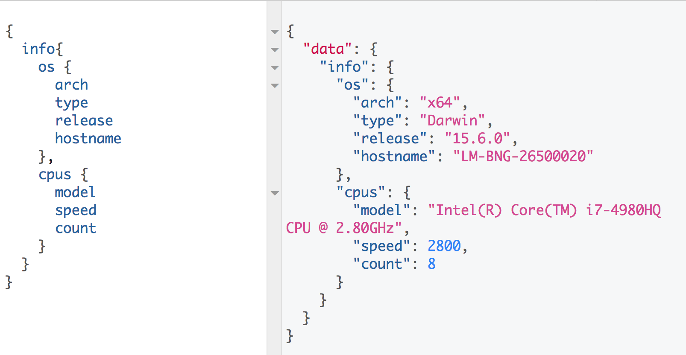

## [system-gql](https://github.com/hemanth/system-gql).
> A graphql interface to query system information [WIP]



## DEMO
Feel free to poke with the [DEMO](https://system-gql.now.sh/graphiql?query=%7B%0A%20%20info%20%7B%0A%20%20%20os%20%7B%0A%20%20%20%20%20arch%0A%20%20%20%20%20type%0A%20%20%20%20%20release%0A%20%20%20%20%20hostname%0A%20%20%20%7D%0A%20%20cpus%20%7B%0A%20%20%20%20model%0A%20%20%20%20speed%0A%20%20%20%20count%0A%20%20%7D%0A%20%20%7D%0A%7D)

## Installation
__Get it:__ `npm install -g system-gql`

## Usage

```
$ system-gql
System info on 3333
```
__Sample Query:__

```
{
  info {
   os {
     arch
     type
     release
     hostname
   }
  cpus {
    model
    speed
    count
  }
  }
}
```

Port will be picked up from `process.env.SYSQL` or defaults to `3333`

## TODO

* Add more fields to the schema.
* Implement generic filters.
* Add default query to the editor.

## License
MIT © [Hemanth.HM](http://h3manth.com)

